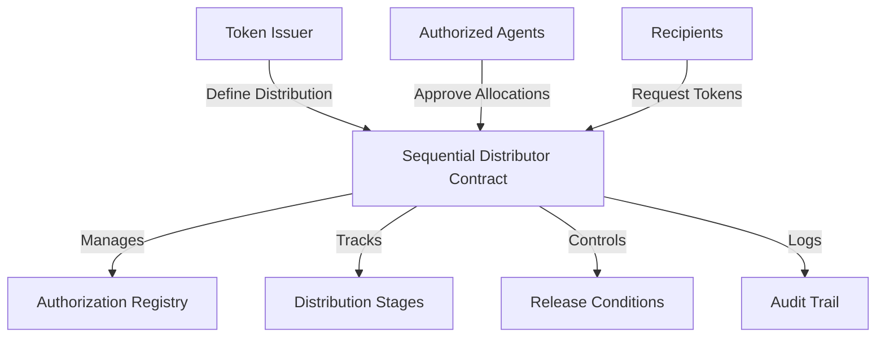

# Sequential Distribution Authorizer

A robust smart contract framework for controlled, sequential asset distribution with strict authorization mechanisms on the Stacks blockchain.

## Overview

Sequential Distribution Authorizer provides a sophisticated platform for managing token allocations with precise control and auditable processes. The system supports:

- Granular access control for token distribution
- Sequential allocation mechanisms
- Multi-stage authorization workflows
- Immutable distribution tracking
- Configurable release conditions
- Comprehensive audit logging

## Architecture

The system is built around a sophisticated authorization and distribution contract with fine-grained control mechanisms.



### Core Components

1. **Authorization Registry**: Manages approved agents and recipients
2. **Distribution Tracking**: Handles sequential token release
3. **Conditional Logic**: Implements complex distribution rules
4. **Compliance Engine**: Ensures regulatory and contractual adherence
5. **Audit Mechanism**: Provides transparent, immutable distribution history

## Contract Documentation

### Main Contract: sequential_distributor.clar

The contract orchestrates complex, controlled token distribution:

#### Key Features

- Multi-stage token allocation
- Strict authorization checks
- Configurable release conditions
- Comprehensive audit logging
- Immutable distribution records
- Flexible agent management

#### Access Control

- Contract Owner: Ultimate system configuration
- Authorized Agents: Can approve and modify allocations
- Recipients: Interact within defined parameters
- Compliance Mechanisms: Enforce predefined rules

## Getting Started

### Prerequisites

- Clarinet
- Stacks wallet
- STX tokens for transactions

### Basic Usage

1. **Define Distribution Stage**:
```clarity
(contract-call? .sequential_distributor define-distribution-stage
    stage-id 
    total-allocation 
    release-conditions 
    authorized-agents)
```

2. **Approve Token Allocation**:
```clarity
(contract-call? .sequential_distributor approve-allocation 
    stage-id 
    recipient 
    allocation-amount)
```

3. **Request Token Release**:
```clarity
(contract-call? .sequential_distributor request-token-release 
    stage-id 
    recipient)
```

## Function Reference

### Distribution Management

```clarity
(define-distribution-stage stage-id total-allocation release-conditions authorized-agents)
(update-distribution-stage stage-id updated-conditions)
(close-distribution-stage stage-id)
```

### Allocation Functions

```clarity
(approve-allocation stage-id recipient allocation-amount)
(revoke-allocation stage-id recipient)
(check-allocation-status stage-id recipient)
```

### Release Mechanisms

```clarity
(request-token-release stage-id recipient)
(force-release stage-id recipient)
(cancel-release stage-id recipient)
```

## Development

### Testing

1. Clone the repository
2. Install Clarinet
3. Run tests:
```bash
clarinet test
```

### Local Development

1. Start Clarinet console:
```bash
clarinet console
```

2. Deploy contract:
```bash
clarinet deploy
```

## Security Considerations

### Asset Verification
- Only authorized verifiers can validate assets
- Verification status is permanent and immutable

### Trading Safety
- All trades use escrow for security
- Automatic fee and royalty calculations
- Built-in expiration for escrow transactions

### Ownership Protection
- Strict ownership checks
- Asset locking during escrow
- Prevention of double-spending shares

### Limitations
- Maximum of 1,000,000 shares per asset
- Maximum 50% royalty rate
- No direct STX refunds
- Locked assets cannot be transferred or modified